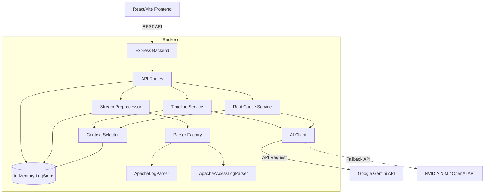

# AIzen Architecture

AIzen is an intelligent log analysis engine built with a Node.js/Express backend and a React/Vite frontend. It uses advanced LLM capabilities (via Google Gemini) to classify log events, generate chronological timelines, and perform root-cause analysis (RCA).

## System Architecture

## Key Components

### 1. Stream-Based Preprocessing & Log Parsing
To prevent memory exhaustion when analyzing huge datasets, AIzen uses a **streaming ingestion pipeline**:
- File uploads are streamed directly to disk.
- Node.js `readline` processes the file line-by-line in batches.
- The `ParserFactory` automatically detects the log format (e.g., Apache Error, Apache Access).
- Parsed logs are batched into `LogStore` to prevent Event Loop blocking.

### 2. The Context Selector (The Secret Sauce)
Large log files easily exceed LLM token limits (even with Gemini's 1M context, 50,000 log lines is slow and expensive). 

The `ContextSelector` solves this by **never sending raw logs to the LLM**. Instead, it uses:
- **Fingerprinting & Deduplication:** "Connection refused on port 8080" and "Connection refused on port 8081" are grouped into a single pattern `Connection refused on port <NUM>`.
- **Time Windowing:** Errors are grouped into hourly buckets so the LLM understands temporal relationships without seeing every timestamp.
- **Stratified Sampling:** For chronological sequences, a representative sample is taken across the time range.
- **Context Windows:** When a specific error is found, the system pulls `±5` lines of surrounding logs to provide local context, discarding the rest of the noise.

*Result: A 180KB log file is compressed into a 6KB highly-structured prompt, reducing token usage by ~95% while improving LLM reasoning.*

### 3. Prompt Engineering & Response Parsing
The system uses native JSON response mode (`response_format: { type: 'json_object' }`) to guarantee structured output. The `ResponseParser` handles edge cases (like trailing commas, markdown code fences, or embedded arrays) to ensure the UI always receives valid data. Prompt constraints are tightly enforced to prevent token limit truncations on massive datasets.

### 4. Frontend Dashboard
Built with Vite, React, and Reshaped UI, the dashboard orchestrates the APIs in a wizard-like flow. It visually connects the classification results, incident timeline, and root cause recovery plan into a single coherent incident report.

### 5. Multi-Model AI Routing
AIzen features an intelligent fallback mechanism. If the primary model fails or experiences rate limits, `AIClient` automatically fails over to an alternative provider via an OpenAI-compatible endpoint (like NVIDIA NIM's DeepSeek/Mistral hosting).

### 6. AI Request Interception & Mocking (Testing)
For continuous integration and offline testing, the `AIClient` is equipped with an interception layer. Every actual API request sent to the LLM (including the final system prompt, user prompt, and model configuration) along with the raw response is automatically logged and saved as a timestamped JSON file in `mocks/api_calls/`. This creates a reliable repository of real-world test data to validate frontend parsing and edge-case handling without consuming additional API credits.

## Tech Stack
- **Frontend:** React, Vite, Reshaped UI v4, Lucide React
- **Backend:** Node.js, Express, express-rate-limit, multer
- **AI Provider:** Multi-model Routing (Google Gemini, NVIDIA NIM, OpenAI-compatible)
- **Deployment:** Vercel (Frontend), Render (Backend)
