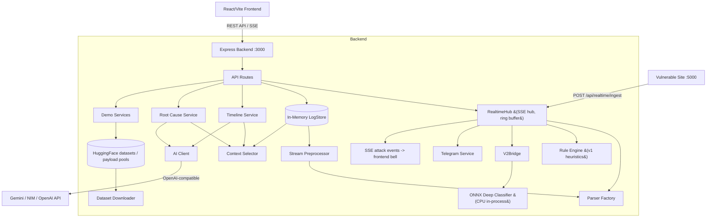

# AIzen Architecture

AIzen is an AI-powered SIEM with a Node.js/Express backend, a React/Vite dashboard, and an intentionally vulnerable demo app. It performs realtime breach detection with a local deep ONNX classifier, plus LLM-assisted log classification, incident timelines, and root-cause analysis (RCA).

## System Architecture

```mermaid
graph TD
    Vuln[Vulnerable Site :5000] -->|POST /api/realtime/ingest| RealHub[RealtimeHub]
    Client[React/Vite Frontend] -->|REST API / SSE| Express[Express Backend :3000]

    subgraph Backend
        Express --> Routes[API Routes]
        Routes --> RealHub[RealtimeHub &#40;SSE hub, ring buffer&#41;]
        Routes --> LogStore[(In-Memory LogStore)]
        Routes --> TimelineService[Timeline Service]
        Routes --> RootCauseService[Root Cause Service]
        Routes --> Demo[Demo Services]

        RealHub --> Parsers[Parser Factory]
        RealHub --> Rules[Rule Engine &#40;v1 heuristics&#41;]
        RealHub --> V2[V2Bridge]
        V2 --> ONNX[ONNX Deep Classifier &#40;CPU in-process&#41;]
        RealHub --> Telegram[Telegram Service]
        RealHub --> BellNotifications[SSE attack events -> frontend bell]

        LogStore --> Preprocessor[Stream Preprocessor]
        Preprocessor --> Parsers
        LogStore --> ContextSelector[Context Selector]
        TimelineService --> ContextSelector
        RootCauseService --> ContextSelector
        TimelineService --> AIClient[AI Client]
        RootCauseService --> AIClient

        Demo --> Datasets[(HuggingFace datasets / payload pools)]
        Datasets --> DatasetDownloader[Dataset Downloader]
    end

    AIClient -->|OpenAI-compatible| LLM[Gemini / NIM / OpenAI API]
```

## Key Components

### 1. Parsing & Streaming Ingestion
- Uploads (`multipart`, `.log`/`.txt`/`.gz`) stream to disk and are processed line-by-line with `readline` — 100K+ lines without exhausting memory.
- Clients can gzip the upload client-side; the server gunzips before parsing.
- `ParserFactory` auto-detects format — Apache Error, Apache Access, Nginx — and extracts structured fields **including the client IP**.

### 2. Realtime Detection Pipeline (`RealtimeHub`)
Every ingested line (from uploads or `POST /api/realtime/ingest`) goes through:
1. **Rules engine (v1):** heuristic keyword/pattern detection (brute force, SQLi, errors…).
2. **v2 deep classifier:** when `V2_CLASSIFIER=onnx`, lines/`classifyBatch` run through the in-process ONNX model, emitting an attack type (`xss`, `sql-injection`, `path-traversal`, `bruteforce`, `scanner`, …) above `V2_THRESHOLD`.
3. **Fan-out:** classified events are pushed over SSE (`type: 'attack'` / `type: 'log'`) and recorded in a ring buffer with running counters, available via `/api/realtime/snapshot`.

### 3. Notifications
- **Bell:** the frontend keeps a global SSE connection and adds an alert for every `attack` event.
- **Telegram:** the `TelegramService` sends a plain-text alert (threat level, attack type, confidence, time, IP, raw content) to a channel with a 5s cooldown. Messages are plain text (no Markdown) so attacker-controlled content can never break parsing.

### 4. Log Classification, Timelines & RCA (Analysis API)
- The **ContextSelector** never sends raw logs to the LLM: it fingerprints & deduplicates (`Connection refused on port <NUM>`), time-windows into buckets, stratifies samples, and slices ±N surrounding lines.
- The **AI Client** routes OpenAI-compatible requests with automatic failover and records every request/response to `mocks/api_calls/` for offline regression testing. Without an API key, analysis degrades to the local `classifier` mode.

### 5. Demo Lab
`/api/demo/trigger` and `/api/demo/stream` replay pre-baked payload pools (SQLi, XSS, brute force, path traversal, floods) through the same realtime pipeline; `datasetDemoService` batches lines through v2 before ingestion.

### 6. Vulnerable Site
A separate Express service (`/product` SQLi, `/search` & `/profile` XSS, `/download` path traversal, `/login` brute force, `/api/admin`) logs every request in Apache format and forwards it to the backend's realtime ingest endpoint.

### 7. Infrastructure
- **Observability:** Winston logs to console and `server/logs/aizen.log`.
- **Deployment:** `render.yaml` defines backend, frontend (static), and vulnerable-site services; frontend typically on Vercel.
- **Testing:** `npm run smoke` covers upload→classify→timeline→RCA; `npm run smoke:realtime` covers the hub ingest/SSE paths.

## Tech Stack
- **Frontend:** React 19, Vite, Tailwind CSS, Lucide React, Sonner (toasts)
- **Backend:** Node.js, Express, multer, express-rate-limit, winston
- **Detection:** Python v2 pipeline (PyTorch → ONNX, `onnxruntime`) loaded in-process; rule engine for v1
- **AI Provider:** Multi-model OpenAI-compatible routing (Gemini / NVIDIA NIM / OpenAI)
- **Deployment:** Render (backend, vulnerable site, static), Vercel (frontend), Hugging Face (datasets/models)