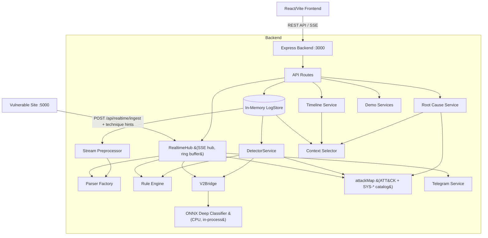

# AIzen Architecture

AIzen is a SIEM with a Node.js/Express backend, a React/Vite dashboard, and an
intentionally vulnerable demo app. It performs real-time breach detection with a
local ONNX deep classifier plus a deterministic rule engine, and produces log
classification, incident timelines, and root-cause analysis (RCA) mapped to
**MITRE ATT&CK**.

> Everything below runs **locally and deterministically**. There is no LLM in the
> analysis path. `AIClient` exists and can be configured, but with no API key the
> classifier and the narrative services fall back to their local
> implementations, which is the default and what CI exercises.

## System Architecture

```mermaid
graph TD
    Vuln[Vulnerable Site :5000] -->|POST /api/realtime/ingest + technique hints| RealHub[RealtimeHub]
    Client[React/Vite Frontend] -->|REST API / SSE| Express[Express Backend :3000]

    subgraph Backend
        Express --> Routes[API Routes]
        Routes --> RealHub[RealtimeHub &#40;SSE hub, ring buffer&#41;]
        Routes --> LogStore[(In-Memory LogStore)]
        Routes --> TimelineService[Timeline Service]
        Routes --> RootCauseService[Root Cause Service]
        Routes --> Demo[Demo Services]

        RealHub --> Parsers[Parser Factory]
        RealHub --> Rules[Rule Engine]
        RealHub --> V2[V2Bridge]
        V2 --> ONNX[ONNX Deep Classifier &#40;CPU, in-process&#41;]
        RealHub --> Mitre[attackMap &#40;ATT&CK + SYS-* catalog&#41;]
        RealHub --> Telegram[Telegram Service]

        LogStore --> Preprocessor[Stream Preprocessor]
        Preprocessor --> Parsers
        LogStore --> Detector[DetectorService]
        Detector --> Rules
        Detector --> V2
        Detector --> Mitre
        LogStore --> ContextSelector[Context Selector]
        TimelineService --> ContextSelector
        RootCauseService --> ContextSelector
        RootCauseService --> Mitre
    end
```

## Detection model: rules first, the deep model as a second opinion

The rule engine and the ONNX classifier run on every line, but they do **not**
have equal authority:

- **Rules are primary.** They key on payload *syntax* (`SELECT … FROM`, `../`,
  `<script>`, `Invalid user`), not on domain vocabulary, which is why they read
  an unfamiliar SIEM dump correctly. Security matching runs against a
  URL-decoded copy too, since payloads in access logs are usually percent-encoded.
- **v2 contributes, but rarely escalates.** It always adds its `attack_type` and
  the resulting technique. To classify a line `Security` *on its own* — i.e. when
  the rules were silent — it must clear `V2_SOLO_MIN_CONFIDENCE` (default 0.90);
  otherwise the event is tagged `v2Only` and stays non-alerting. A v2 verdict also
  never lowers the rule engine's confidence.
- **Technique attribution follows the primary detector.** When the rules matched,
  their families decide the ATT&CK technique; v2 only supplies it when the rules
  were silent. Otherwise a model that reads a SQL-injection payload as
  "bruteforce" bolts a wrong technique onto a correct verdict.

## MITRE ATT&CK mapping

`server/mitre/attackMap.js` is the single vocabulary, keyed on a normalized
family space that covers both the rule engine's `securityTypes` and the deep
model's `attack_type` spellings (`credential_probe` / `bruteforce` / `xss` /
`scanner` are aliased onto the rule family names).

| Family | Technique | Tactic |
|---|---|---|
| `CREDENTIAL_PROBE` | T1552.001 Credentials In Files | Credential Access |
| `PATH_TRAVERSAL`, `DIRECTORY_FORBIDDEN` | T1083 File and Directory Discovery | Discovery |
| `SQL_INJECTION` | T1190 Exploit Public-Facing Application | Initial Access |
| `ADMIN_BRUTE_FORCE`, `AUTH_FAILURE` | T1110 Brute Force | Credential Access |
| `XSS_PROBE` | T1059.007 JavaScript | Execution |
| `SCANNER_SIGNATURE` | T1595 Active Scanning | Reconnaissance |

Non-attack failures are catalogued **separately** under a `SYS-*` namespace
(`SYS-NGINX-UPSTREAM-DOWN`, `SYS-CONFIG-INTEGRITY`, …). An upstream timeout is an
operational fault, not an ATT&CK technique, and labelling it as one would be
wrong — so RCA returns two lists, never merged.

The label space is **open**: `config.is_valid_attack_type()` accepts any
`T####`/`T####.###` id, so a new annotated corpus adds classes with no code
change, and the runtime already reads whatever `meta.json` contains.

## Key Components

### 1. Parsing & Streaming Ingestion
- Uploads (`multipart`, `.log`/`.txt`/`.gz`) stream to disk and are processed
  line-by-line with `readline` — 100K+ lines without exhausting memory.
- `ParserFactory` auto-detects format (Apache Error, Apache Access, Nginx,
  OSSEC/Wazuh alert blocks) and extracts structured fields including the client IP.
- SIEM alert blocks are split into an **envelope** (`message`: alert description +
  body) and a **payload** (the log evidence alone). The UI and RCA render the
  envelope; the model and the labeler read the payload, so the network learns the
  log line rather than the SIEM's wrapper text.

### 2. Realtime Detection Pipeline (`RealtimeHub`)
Every line (uploads or `POST /api/realtime/ingest`) goes through:
1. **Parser** → 2. **Rule engine** → 3. **v2 ONNX** (if enabled) → 4. **ATT&CK
   mapping** → 5. fan-out as SSE `attack`/`log`/`alert` frames plus a ring buffer
   and counters at `/api/realtime/snapshot`.

Events carry `techniques: [{id,name,tactic,url}]`. Sources may also pass
`techniques` (the vulnerable site declares which attack each route models); that
arrives as `expectedTechniques` and is **ground truth only** — it never
influences classification, it just makes a miss visible on the live feed.

### 3. Notifications
- **Bell:** the frontend holds a global SSE connection and raises an alert per
  `attack` event, with the ATT&CK technique chips.
- **Telegram:** plain-text alert (threat level, type, confidence, time, IP, raw)
  with a 5s cooldown. Plain text so attacker-controlled content cannot break
  parsing.

### 4. Log Classification, Timelines & RCA
- The **ContextSelector** fingerprints and deduplicates
  (`Connection refused on port <NUM>`), time-windows into buckets, stratifies
  samples, and slices ±N context lines.
- `DetectorService` blends the rule verdict with the deep model's, using a
  dataset-level **holdout split** so validation measures generalization rather
  than memorization of one pooled corpus.
- `RootCauseService` returns `rootCause`, `evidence`, `causalChain`, `impact`,
  `recommendations[]`, **`techniques[]`**, `systemErrors[]`, `confidence`, and
  `analysisNotes`. Every attack recommendation carries a technique; every
  operational one carries a `SYS-*` error.

### 5. Demo Lab
`/api/demo/trigger` and `/api/demo/stream` replay payload pools (SQLi, XSS, brute
force, path traversal, floods) through the same realtime pipeline;
`datasetDemoService` batches lines through v2 before ingestion.

### 6. Vulnerable Site
A separate Express service (`/product` SQLi, `/search` & `/profile` XSS,
`/download` path traversal, `/login` brute force, `/api/admin`) logs every request
in Apache format, forwards it to the realtime ingest endpoint, and declares the
ATT&CK technique each route models.

### 7. Infrastructure
- **Observability:** Winston → console and `server/logs/aizen.log`.
- **Deployment:** `render.yaml` (backend, static frontend, vulnerable site);
  frontend on Vercel; model artifacts on Hugging Face.

## Verification

| Command | Covers |
|---|---|
| `npm run smoke` | upload → classify → timeline → RCA schemas |
| `npm run smoke:realtime` | hub ingest and SSE paths |
| `npm run check:mitre` | ATT&CK payload shape, `SYS-*` separation, real-logfile RCA |
| `npm run check:join` | the v2 verdict registry holds only real deep-model verdicts |
| `npm run check:model` | cross-domain false-positive rate and per-class recall vs a stored baseline |
| `npm run check:tokenizer` | Python ↔ JS train/serve tokenizer parity |
| `npm run check:rtmitre` | real-time technique mapping and the ground-truth invariant |

`check:model` is the important one: an earlier retrain scored 0.983 on the
in-domain split while its false-positive rate on held-out SIEM data got *worse*
(10.8% → 14.8%) and recall fell (90.4% → 73.0%). That gate exists so a retrain
cannot pass while generalizing worse.

## Tech Stack
- **Frontend:** React 19, Vite, Tailwind CSS, Lucide React, Sonner
- **Backend:** Node.js, Express, multer, express-rate-limit, winston, zod
- **Detection:** deterministic rule engine (primary) + char-level LSTM exported to
  ONNX (`onnxruntime-node`, CPU, in-process) as a second opinion
- **Training (offline):** Python + PyTorch in `v2/`, exporting INT8 ONNX plus a
  `meta.json` describing the label space and per-class thresholds
- **Deployment:** Render (backend, vulnerable site, static), Vercel (frontend),
  Hugging Face (model artifacts)
